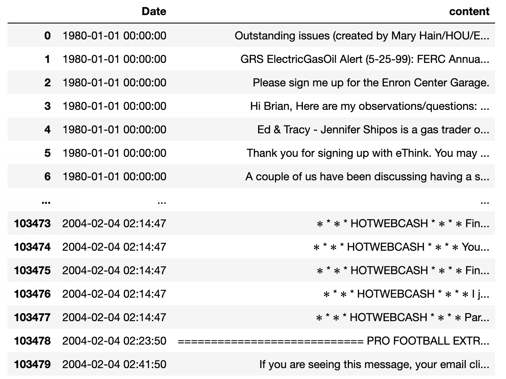

# Enron Email Analysis

I have 1.7 MM emails to read through and need a fast an efficient way of cycling through them. Reading through them will take me over 393 - 24 hour days to read through. I don't have time to be reading office gossip as well, give me the nitty gritty. How can I be more efficient at this.

## Getting Started

Included in this repository is Jupyter Notebook with the code to run through this project. You will need the data set from Bryan Ray. This data set may be found at the link below:

[Enron Data set](https://data.world/brianray/enron-email-dataset) - Complete set of email corpus publicly available.

[Dataset Utilized](https://www.kaggle.com/adriancampos/enron-email-20-percent) - 20% of actual corpus used in this project.

### Data Description and Dictionary

[Enron Dataset Dictionary](data/datadictionary.txt) - Data dictionary for complete Enron Data Set The only data utilized for this project was the 'Date' and 'content' columns.


### Prerequisites

The following libraries and imports will be needed to fully run this notebook.

```
from sklearn.feature_extraction.text import CountVectorizer, ENGLISH_STOP_WORDS, TfidfVectorizer
from sklearn.feature_extraction import stop_words
from sklearn.cluster import KMeans
from sklearn.decomposition import PCA
import numpy as np
import pandas as pd
import matplotlib.pyplot as plt
import seaborn as sns; sns.set()  # for plot styling

from sklearn.model_selection import train_test_split, GridSearchCV
from sklearn.pipeline import Pipeline
from sklearn import metrics
from joblib import dump, load
```

### Installing

After cloning and downloading the repository simply run the enron_analysis_all_countvectorizer.ipynb notebook. You will need to change your downloaded dataset location

```
df = pd.read_csv('/Users/adriancampos/Downloads/enron_emails_all.csv')
```

I decided to leave my dataset in my downloads folder, as it's over 2 gigs in size and my system is set up to archive everything in the cloud - outside the downloads folder. FYI

You will notice that I only used 20% of my emails in line 3.

```
df = df.sample(frac=.2)
```

This was intentional, as my kernel kept crashing with anything more than this amount.

However, you may opt to follow the same path and only utilize the same dataset I used. If so, the Jupyter notebook utlized is available here:

* [20% Jupyter Notebook](Enron_Email_Analysis_K-means_clustering.ipynb)

To utilize whole corpus, please use this notebook:

* [100% Jupyter Notebook](enron_email_analysis-all-countvectorize.ipynb)

You should see the following dataset after dropping all but Date & content columns in line 11.




## Findings

A more robust, but not exhaustive description of findings may be found at the link below:


* [Portofolio Project Link](https://adriancampos.me/project/enron-email-analysis/)


## Built With

* [Python ](https://www.python.org/) - and associated libraries
* [Anaconda](https://anaconda.org/) - Packages, notebooks, & projects
* [Tableau](tableau.com) - Online presentation & visualizations

## Versioning

We use [Github](https://github.com) for versioning/version control.


## Author

#### Adrian Campos

* [Portfolio](https://adriancampos.me)
* [github](https://github.com/adriancampos1)
* [Linkedin](https://linkedin.com/in/adriancampos1)


## License

This project is licensed under the MIT License - see the [LICENSE](LICENSE) file for details

## Acknowledgments

* **Bryan Ray** [Linkedin](https://www.linkedin.com/in/brianray/) - Provided the clean and sorted dataset for this project.

* **CMU Students** [website](https://www.cs.cmu.edu/~./enron/) - Categorization provided by CMS graduate students.
